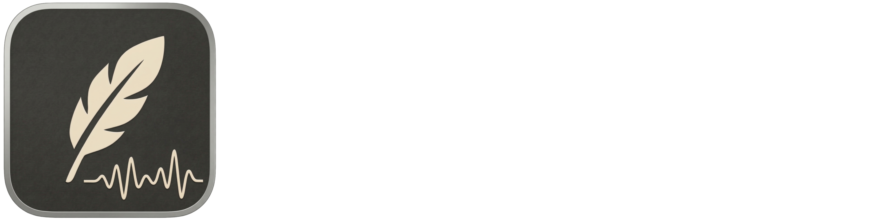
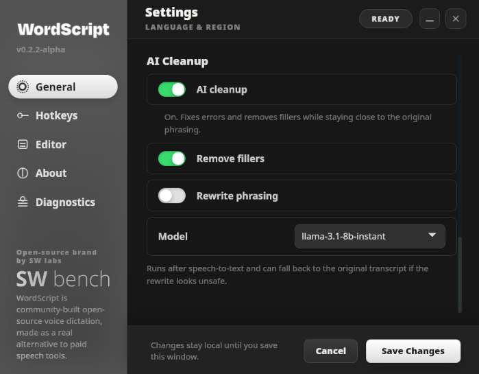
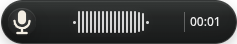

# WordScript

WordScript is a community-built desktop dictation app for one job: trigger recording, speak, and get usable text back into the current text field without losing your flow.

It is being built in public under SW bench, the open-source brand of SW labs, where tools like WordScript are built with contributors instead of behind a closed product paywall.

## Interface





## Why this exists

WordScript exists because basic productivity input should not feel like a subscription tax. Speaking into your computer, cleaning the text up, and continuing to work should not require a bloated assistant product, opaque lock-in, or another expensive subscription. 

The target is a genuinely good dictation product first. A commercial release path can exist later, but the project is not being built around artificial scarcity. The near-term goal is a strong open alternative to paid AI voice-dictation apps that people can inspect, run from source, improve, and ship together.

## Current status

- Repo version: `0.2.2-alpha`
- Use today: `npm run tauri dev`
- Current reality: WordScript is usable today as a source-first developer build
- In progress: the first official cross-platform app release for Linux, macOS and Windows
- Not live yet: published installers, trusted download channel, signed in-place updater

## What already works

- native start/stop, pause/resume and abort hotkeys
- native microphone capture with waveform, silence timeout and max-duration stop
- Groq BYOK transcription with OS secret-store storage
- transform pipeline with hallucination guardrails, optional AI cleanup, dictionary and snippets
- native insertion with direct paste, clipboard fallback, scratchpad recovery and last-transcript restore
- platform diagnostics and runtime logs
- active settings surfaces for Provider & Models, Input, Text Rules, About and Diagnostics
- manual release build-up lanes for Linux, macOS and Windows

## What still needs work

- first published installers and signing flow
- stable release handoff across Linux, macOS and Windows
- Linux AppImage packaging that no longer stalls on the current linuxdeploy lane
- live updater path after the first real release
- stronger Linux Wayland reliability
- more product polish around recovery, diagnostics and text-rule workflows

## Contribute

If you want a real open desktop dictation tool instead of another subscription-heavy voice product, this is a good moment to join.

Good contribution areas right now:

- runtime stability on Linux, macOS and Windows
- capture, insertion and recovery edge cases
- release engineering and packaging
- UI clarity, diagnostics and support messaging
- text rules, tests and product polish

## Use today

The current usable WordScript version is the developer build from this repository.

```bash
npm install
npm run tauri dev
```

That is the version you should actually use today. In parallel, the team is building the first official cross-platform app release for Linux, macOS and Windows.

## Quick start

### Requirements

- Node.js 18+
- Rust + Cargo
- macOS: Xcode Command Line Tools; Homebrew is recommended for the bootstrap script
- Windows: Visual Studio Build Tools with the C++ workload and the Microsoft WebView2 Runtime
- Linux packages for Tauri/WebKitGTK: `libwebkit2gtk-4.1-0`, `libayatana-appindicator3-1`, `libxdo3`

### Bootstrap once per machine

macOS and Linux:

```bash
bash setup-tauri.sh
```

Windows PowerShell:

```powershell
powershell -ExecutionPolicy Bypass -File .\setup-tauri.ps1
```

### Run from source

macOS and Linux:

```bash
git clone https://github.com/SW-Bench/WordScript.git
cd WordScript
npm install
npm run tauri dev
```

Windows PowerShell:

```powershell
git clone https://github.com/SW-Bench/WordScript.git
cd WordScript
npm install
npm run tauri dev
```

`npm run tauri dev` is the current developer version of WordScript and the recommended way to use the app today while the first official release is still under construction.

Platform notes for real insert checks:

- macOS development builds can require Accessibility and sometimes Input Monitoring for the process that launched WordScript, for example Terminal or VS Code
- Windows synthetic paste can still fail against elevated target apps if WordScript itself is not running elevated
- Linux Wayland remains the most fallback-heavy path right now

### Validate changes

```bash
npm test
npm run build
cd src-tauri && cargo test
```

The default repo path remains source-first. `npm run tauri build` and `.github/workflows/release.yml` are active release-build-up tools, but they are not a live installer channel yet. The Linux AppImage lane is still being hardened and can currently fail around `linuxdeploy`.

## Runtime model

WordScript currently supports one active transcription provider in the product path: Groq.

Runtime credentials stay with the user:

- the end user stores their own Groq API key in the OS secret store
- the JSON config is scrubbed on save
- there is no hosted WordScript backend or shared WordScript API key in the current product path

Distribution credentials and signing remain part of the release build-up. They are intentionally not described as active user delivery while no published releases exist.

## Platform support

| Platform | Support level | Current reality |
|---|---|---|
| Windows | Tier 1 target | Native trigger, capture and insert path; release packaging is in build-up, not yet a published channel |
| macOS | Tier 1 target | Native trigger, capture and insert path; dev-mode privacy permissions can gate auto-paste while release packaging is still being assembled |
| Linux X11 | Preview | Usable desktop path with a smaller stability promise |
| Linux Wayland | Experimental | XWayland- and clipboard-heavy fallback path |

Details about recovery behavior, provider constraints and open product gaps live in [docs/REFERENCE.md](docs/REFERENCE.md).

## Documentation map

The documentation set is intentionally small:

- [docs/VISION.md](docs/VISION.md): product direction, V1/V2 boundaries and the current build-up priorities
- [docs/ARCHITECTURE.md](docs/ARCHITECTURE.md): runtime ownership, module boundaries and system flow
- [docs/DEVELOPMENT.md](docs/DEVELOPMENT.md): setup, validation and repo working rules
- [docs/DESIGN_SYSTEM.md](docs/DESIGN_SYSTEM.md): UI principles and current product-surface rules
- [docs/REFERENCE.md](docs/REFERENCE.md): factual product state, limits and support matrix
- [docs/RELEASE_RUNBOOK.md](docs/RELEASE_RUNBOOK.md): release workflow and remaining gates before public rollout

## License

[MIT](LICENSE)
