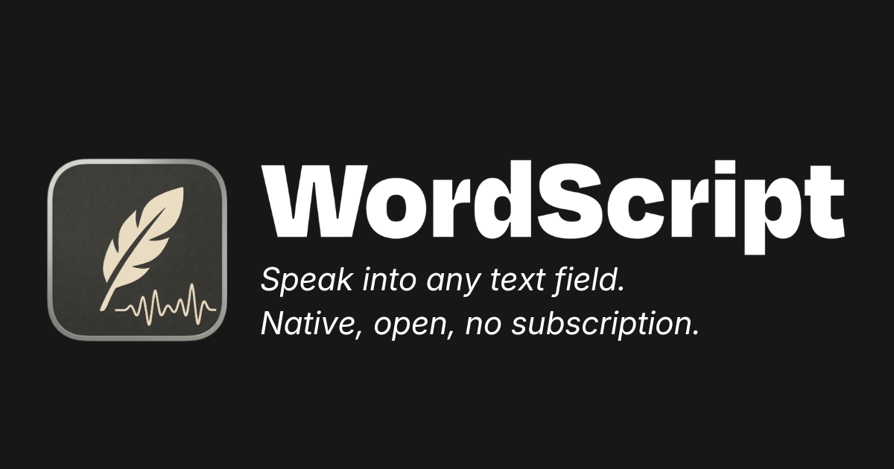

# WordScript

WordScript is a community-built desktop dictation app for one job: trigger recording, speak, and get usable text back into the current text field without losing your flow.

It is being built in public under SW bench, the open-source brand of SW labs, where tools like WordScript are built with contributors instead of behind a closed product paywall.

## Interface


## Why this exists

WordScript exists because basic productivity input should not feel like a subscription tax. Speaking into your computer, cleaning the text up, and continuing to work should not require a bloated assistant product, opaque lock-in, or another expensive subscription. 

The target is a genuinely good dictation product first. A commercial release path can exist later, but the project is not being built around artificial scarcity. The near-term goal is a strong open alternative to paid AI voice-dictation apps that people can inspect, run from source, improve, and ship together.

Long-term, WordScript can grow beyond dictation into a broader open voice workspace with meeting transcripts, notes, search, sync, API / MCP, and later assistant-style desktop actions. The product is intentionally not starting there. The current discipline is to earn that expansion on top of a stable dictation core.

## Current status

- Repo version: `0.2.2-alpha`
- Use today: `npm run tauri dev`
- Current reality: WordScript is usable today as a source-first developer build
- In progress: the first official cross-platform app release for Linux, macOS and Windows
- Not live yet: published installers, trusted download channel, signed in-place updater

## What already works

- native start/stop, pause/resume and abort hotkeys
- native microphone capture with waveform, silence timeout and max-duration stop
- guarded native session finalization, so late provider, transform or insertion results cannot overwrite the current runtime state after aborts or newer captures
- Groq BYOK transcription with OS secret-store storage
- first generic provider contract in Rust and Tauri, with typed provider modes, capabilities, recovery actions and local-setup readiness; Groq remains the cloud-first production lane and `local_preview` is the compatibility id for the full local runtime lane with native model discovery, selected STT/cleanup setup truth, prompt-bias support, probe-based runner diagnostics and local Ollama cleanup
- transform pipeline with hallucination guardrails, profile-aware AI cleanup, and profile/dictionary-guided transcription prompts across Groq and the local CLI lane so mixed-language and technical terms survive more reliably, plus local text profiles with explicit STT hints, seeded curated baselines, dictionary and snippets
- native insertion with direct paste, clipboard fallback, typed recovery actions, clipboard-restore status, scratchpad recovery and last-transcript restore, with recovery wording separated from diagnostics preview and durable history
- native transcription history with retention policy, server-side filters, JSON export, retry and persisted insert-recovery semantics, plus a dedicated diagnostics view that shows the persistent history store separately from transient runtime logs and scratchpad recovery
- diagnostics history, decoded runtime-log hints and long Text Rules card lists now keep stable render boundaries, so routine filter edits and rule changes no longer force every visible card to rebuild at once
- platform diagnostics and runtime logs, including a stage timeline for capture, provider, transform and insert with per-step state, duration and stable error-code truth
- active settings surfaces for Provider & Models, Input, Text Rules, About and Diagnostics, plus a grouped utility sidebar with a persistent profile dock for manual profile switching and a sequenced Text Rules workspace with a compact process summary, profile/setup deck, curated-profile overview, pinned stage navigation and one dominant working canvas at a time
- a calmer utility-style Settings shell with native window controls, grouped navigation, a compact tab header, explicit runtime/save-state chips and one dominant content surface that behaves more predictably on Linux
- a dedicated native diagnostics preview window that reuses the same Rebuild Lab surface in a calmer pop-out instead of falling back to a separate fake-chrome shell
- manual release build-up lanes for Linux, macOS and Windows

## What still needs work

- first published installers and signing flow
- stable release handoff across Linux, macOS and Windows
- Linux AppImage packaging that no longer stalls on the current linuxdeploy lane
- live updater path after the first real release
- stronger Linux Wayland reliability
- work-mode capable profiles beyond static context, optional STT hints, dictionary and snippets, with explicit defaults for rewrite, insertion and recovery and later opt-in activation by app or context
- a live-preview and controlled-commit overlay that shows raw text, cleaned text, the active work mode and quick recovery actions
- at least one second production provider plus a clearer mode model for `fast`, `quality`, `local` and `self_hosted`
- guided model management, install/pull checks and a smoother first-run path for the existing local runtime lane
- final live-host verification and cross-window polish so the calmer utility direction stays consistent across settings and overlay states on Windows, macOS and Linux without platform-fake chrome
- guided setup, permissions and packaging that get users from install to first useful dictation without having to reverse-engineer diagnostics output

## Planning references

- benchmark and donor matrix: [docs/BENCHMARK_MATRIX.md](docs/BENCHMARK_MATRIX.md) for dictation donors plus the expanded macOS-native UI/UX donor lanes
- product direction and staging: [docs/VISION.md](docs/VISION.md)
- active system ownership: [docs/ARCHITECTURE.md](docs/ARCHITECTURE.md)

## Contribute

If you want a real open desktop dictation tool instead of another subscription-heavy voice product, this is a good moment to join.

Good contribution areas right now:

- runtime stability on Linux, macOS and Windows
- capture, insertion and recovery edge cases
- release engineering and packaging
- UI clarity, diagnostics and support messaging
- text rules, tests and product polish

## Use today

The current usable WordScript version is the developer build from this repository.

```bash
npm install
npm run tauri dev
```

That is the version you should actually use today. In parallel, the team is building the first official cross-platform app release for Linux, macOS and Windows.

## Quick start

### Requirements

- Node.js 18+
- Rust + Cargo
- macOS: Xcode Command Line Tools; Homebrew is recommended for the bootstrap script
- Windows: Visual Studio Build Tools with the C++ workload and the Microsoft WebView2 Runtime
- Linux packages for Tauri/WebKitGTK: `libwebkit2gtk-4.1-0`, `libayatana-appindicator3-1`, `libxdo3`

### Bootstrap once per machine

macOS and Linux:

```bash
bash setup-tauri.sh
```

Windows PowerShell:

```powershell
powershell -ExecutionPolicy Bypass -File .\setup-tauri.ps1
```

### Run from source

macOS and Linux:

```bash
git clone https://github.com/SW-Bench/WordScript.git
cd WordScript
npm install
npm run tauri dev
```

Windows PowerShell:

```powershell
git clone https://github.com/SW-Bench/WordScript.git
cd WordScript
npm install
npm run tauri dev
```

`npm run tauri dev` is the current developer version of WordScript and the recommended way to use the app today while the first official release is still under construction.

Platform notes for real insert checks:

- macOS development builds can require Accessibility and sometimes Input Monitoring for the process that launched WordScript, for example Terminal or VS Code
- Windows synthetic paste can still fail against elevated target apps if WordScript itself is not running elevated
- Linux Wayland remains the most fallback-heavy path right now

### Validate changes

```bash
npm test
npm run build
cd src-tauri && cargo test
```

The default repo path remains source-first. `npm run tauri build` and `.github/workflows/release.yml` are active release-build-up tools, but they are not a live installer channel yet. The Linux AppImage lane is still being hardened and can currently fail around `linuxdeploy`.

## Runtime model

WordScript currently ships with two runtime lanes behind the same provider contract:

- Groq as the cloud-first production lane with BYOK stored in the OS secret store
- `local_preview` as the compatibility id for the local runtime lane, which runs speech-to-text through an external `whisper-cli` helper plus local ggml models and runs cleanup through a local Ollama model, with typed setup truth for the selected STT model and cleanup model, active runner probes, discovered local profiles, fast-vs-quality preset labels and stable issue codes in Settings

Runtime credentials stay with the user:

- the end user stores their own Groq API key in the OS secret store
- the JSON config is scrubbed on save
- there is no hosted WordScript backend or shared WordScript API key in the current product path

Local runtime prerequisites today:

- install `whisper-cli` in `PATH` or point `WORDSCRIPT_LOCAL_WHISPER_CLI` at the binary
- set `WORDSCRIPT_LOCAL_MODEL_PATH` to one ggml model file or `WORDSCRIPT_LOCAL_MODEL_DIR` to a directory that contains `ggml-<model>.bin` or common variant files such as quantized or `.en` model builds
- run Ollama locally at `http://127.0.0.1:11434` or point `WORDSCRIPT_LOCAL_CHAT_BASE_URL` at another local endpoint
- keep a local cleanup model installed in Ollama; the Settings lane stores this separately from the Groq cleanup model and resolves it through the native provider status
- expect the Settings profile picker to come from native profile discovery; each local model now exposes explicit `fast` and `quality` profiles, and local readiness still follows the resolved model behind the selected profile
- expect the active text-profile prompt plus explicit profile-owned STT hints and dictionary terms to feed local STT bias through `whisper-cli --prompt`, with explicit Settings controls for `off`, `profile`, `profile + terms`, and optional `carry initial prompt`; snippet triggers are not forwarded automatically
- expect explicit local decode controls for `beam size` and `best of`; the selected profile sets the starting defaults, but the decoder search depth is now a persisted runtime choice instead of a hidden preset side effect
- expect Diagnostics and transcription history to record the active local provider profile together with prompt-bias, decode settings, resolved cleanup endpoint and cleanup model, so local regression triage can see more than just provider and model
- expect those local decode controls to persist per local provider profile, not as one global local pair; switching between `fast` and `quality` profiles now restores the saved decoder settings of that specific profile
- expect the local prompt-bias controls to persist per local provider profile too; switching between `fast` and `quality` now restores the saved `off`/`profile`/`profile + terms` and `carry initial prompt` state of that exact profile
- expect Rebuild Lab to show the native runtime contract separately from unsaved Settings edits, so you can see when local runtime changes in the window have not been saved into the running runtime yet
- expect Rebuild Lab to include live provider readiness, resolved runner/model paths, resolved cleanup endpoint/model and current native capture device/state in that runtime contract, not just the last saved provider/model config
- expect speech-to-text plus local cleanup in the same local lane; cleanup still falls back conservatively to the raw transcript when the local model is unavailable or returns unsafe text

Distribution credentials and signing remain part of the release build-up. They are intentionally not described as active user delivery while no published releases exist.

## Platform support

| Platform | Support level | Current reality |
|---|---|---|
| Windows | Tier 1 target | Native trigger, capture and insert path; release packaging is in build-up, not yet a published channel |
| macOS | Tier 1 target | Native trigger, capture and insert path; dev-mode privacy permissions can gate auto-paste while release packaging is still being assembled |
| Linux X11 | Preview | Usable desktop path with a smaller stability promise |
| Linux Wayland | Experimental | XWayland- and clipboard-heavy fallback path |

Details about recovery behavior, provider constraints and open product gaps live in [docs/REFERENCE.md](docs/REFERENCE.md).

## Documentation map

The documentation set is intentionally small:

- [docs/VISION.md](docs/VISION.md): product direction, V1/V2 boundaries and the current build-up priorities
- [docs/ARCHITECTURE.md](docs/ARCHITECTURE.md): runtime ownership, module boundaries and system flow
- [docs/DEVELOPMENT.md](docs/DEVELOPMENT.md): setup, validation and repo working rules
- [docs/DESIGN_SYSTEM.md](docs/DESIGN_SYSTEM.md): UI principles and current product-surface rules
- [docs/REFERENCE.md](docs/REFERENCE.md): factual product state, limits and support matrix
- [docs/RELEASE_RUNBOOK.md](docs/RELEASE_RUNBOOK.md): release workflow and remaining gates before public rollout

## License

[MIT](LICENSE)
